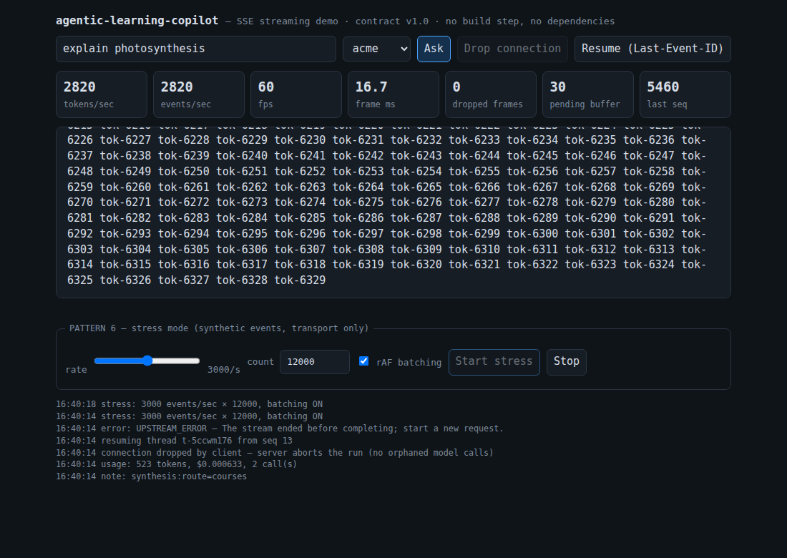

# Streaming demo — manual script and expected numbers

The demo client (`demo/client.html`) is the teaching artifact for client-side
state management under high-frequency streams. It is one self-contained file:
vanilla JS, no build step, no dependencies — the six patterns it demonstrates
are labeled `PATTERN 1`–`PATTERN 6` in its source.



## Run it

```
npm ci
npm run serve
```

Open <http://localhost:3000>. Everything below is offline — mock model, fixture
corpus (Arabic included), no keys.

## Script

### 1. A real streamed turn (~5 s)

Type a question (default: "explain photosynthesis"), press **Ask**.

Expect, in order: `route: courses (confidence …)` in the meta line, citations
next, then tokens visibly arriving (the demo server streams with a 15 ms
inter-chunk delay), then a **PARITY OK** badge.

The badge is computed client-side: the `done` event carries the answer's
SHA-256 and UTF-8 byte count, and the client hashes what it actually rendered
(contract §3). If the streamed bytes ever diverged from the batch answer, this
badge — not a server log — turns red.

Try the `meydan` org with an Arabic query (`ما هو التمثيل الضوئي`) to see the
parity machinery hold on RTL multi-byte text.

### 2. Resume (~15 s)

Press **Ask**, then **Drop connection** mid-stream, then **Resume**.

Expect: the log shows the drop, then `resuming thread t-… from seq N`. Because
the server aborts the graph run when the client disconnects (no orphaned model
calls), the dead turn's replay ends with `UPSTREAM_ERROR (partial)` — contract
R7, shown honestly rather than hidden. Resume after a turn *completed* replays
the missing tail and ends in `done`.

### 3. Stress mode — the before/after (~1 min)

Set rate 3000/s, count 12000, **rAF batching ON** (default). Start stress.

| HUD | Expected (batching ON) |
| --- | --- |
| fps | ~60, steady |
| events/sec | ~2800–2900 (rate minus tick rounding) |
| frame ms | ~16.7 |
| dropped frames | 0–2 over the whole run |
| pending buffer | tens to a few hundred, draining every frame |

Now untick **rAF batching**, set count 3000 (deliberately smaller), start again.

| HUD | Expected (batching OFF) |
| --- | --- |
| page | main thread freezes outright for several seconds |
| fps | collapses (≈26 on recovery in headless Chromium; worse headed) |
| frame ms | ≈38+ |
| dropped frames | 100+ for a quarter of the event count |

Measured on the offline server in headless Chromium 1194: ON = 60 fps /
2,820–2,880 events/sec / 0–2 dropped across 12,000 events; OFF = main thread
unresponsive ~5 s for 3,000 events, fps 26 and frame 37.9 ms at recovery,
110+ missed frames. Numbers vary by machine; the *shape* — steady 60 vs
freeze — is the demonstration.

Why: batching OFF is the labeled anti-pattern in `ingest()` — `innerHTML +=`
(full re-serialize + re-parse of the panel) plus a `scrollHeight` read forcing
synchronous layout, per event. Batching ON routes every event through a buffer
drained once per `requestAnimationFrame`, with one string build, one DOM write
and one scroll per frame, regardless of event rate. Same stream, same machine —
the render architecture is the only variable.

Note on the dropped-frames counter: it counts the frames that *should have
fired* during a gap (a 5-second freeze ≈ 300 missed frames), because a counter
that reports a total freeze as "1 hitch" would be lying — and during a full
freeze the fps stat can't update at all, which is itself the tell.

## What each pattern buys (labels in demo/client.html)

1. **Ingestion decoupled from render** — network events land in an array;
   nothing touches the DOM outside the rAF loop.
2. **Token coalescing** — one string-builder, one text-node write, one scroll
   per frame; per-token DOM writes are the anti-pattern half of the toggle.
3. **Monotonic seq guard** — `seq > lastSeq` (not `+1`: heartbeats consume seq
   without being replayed); contiguous `token.index` is the answer's own gap
   detector.
4. **Reconnect/resume** — the endpoint is POST, so `EventSource` does not
   apply; the client hand-rolls the reader and sends `Last-Event-ID` itself.
5. **Latency HUD** — sampled on a fixed 500 ms window, independent of both the
   ingestion path and the render loop, so it stays honest when either stalls.
6. **Stress mode** — `POST /v1/stress` mints synthetic contract-valid token
   events at the wire (no copilot, not buffered for resume) at 1–5k events/sec,
   with real parity witnesses on `done` so the checker works under stress too.
